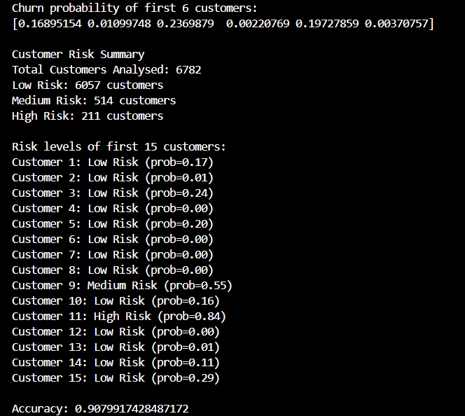
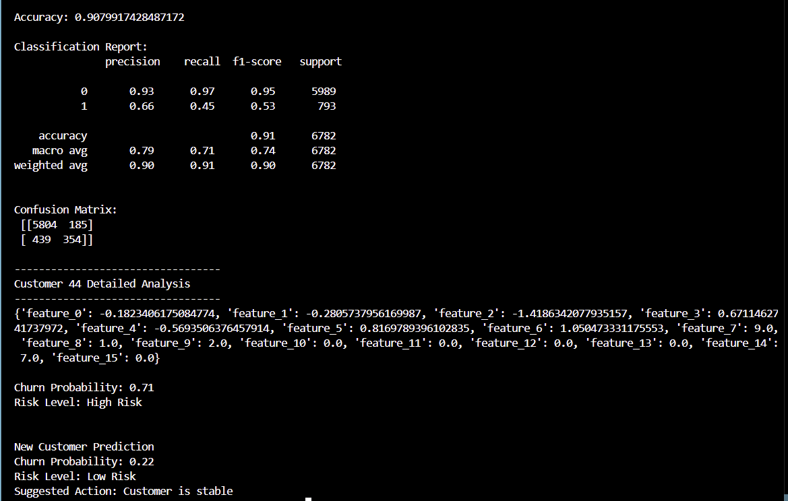
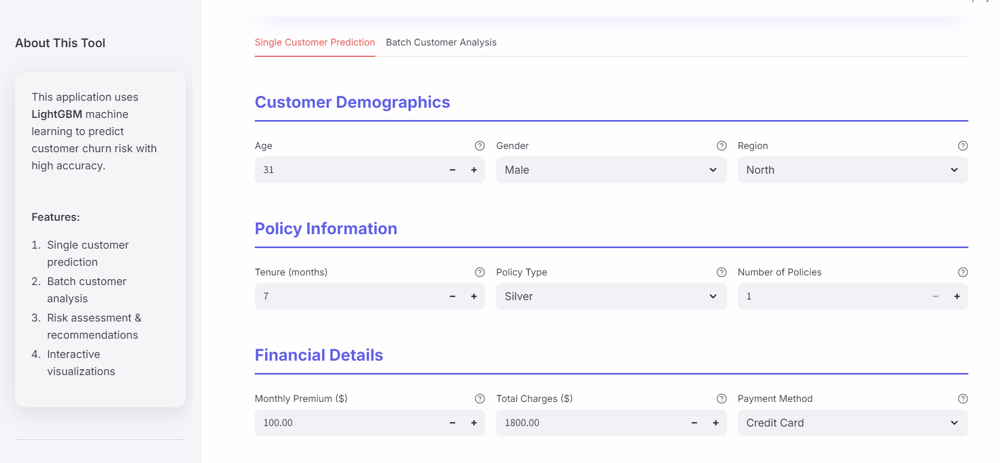
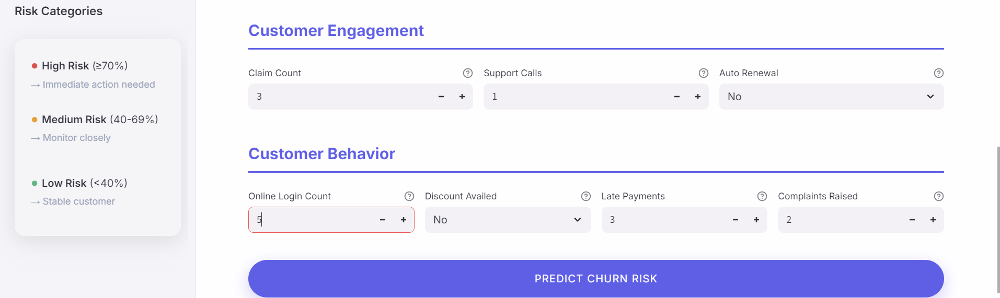
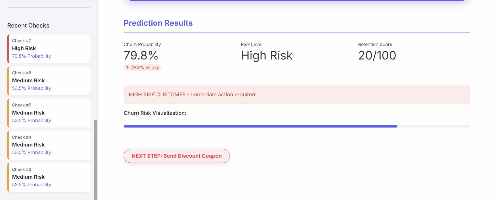
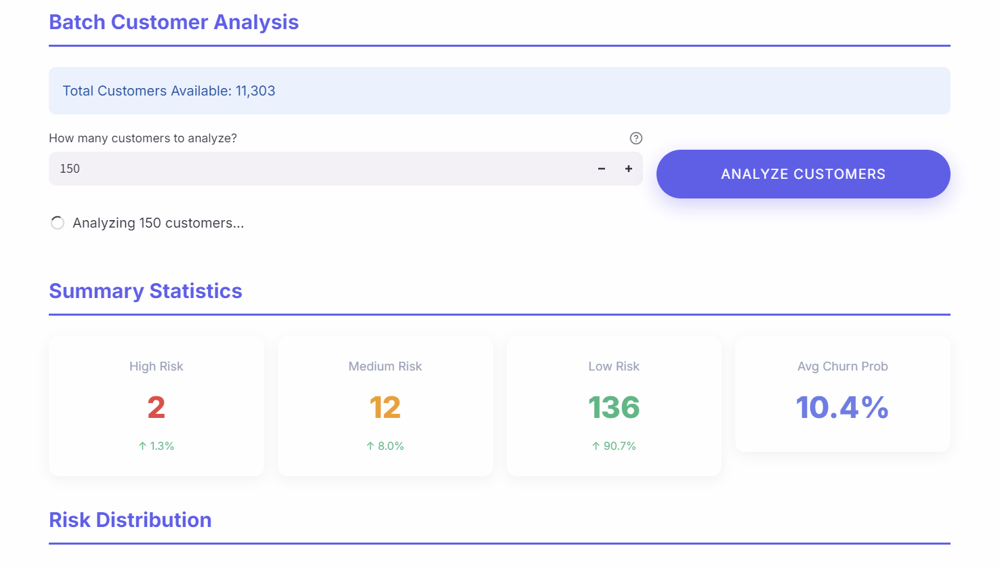
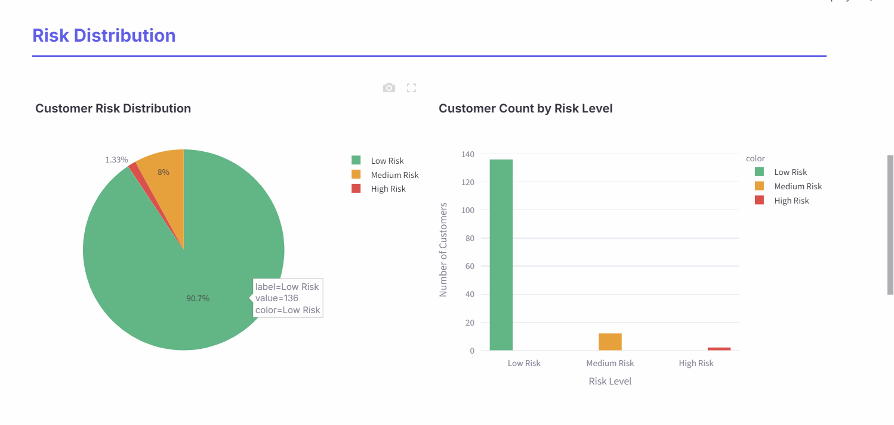
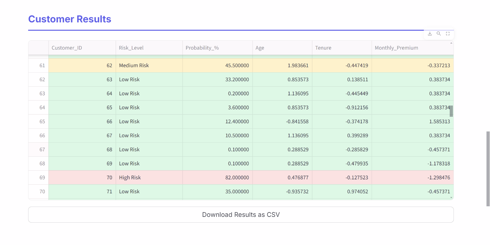
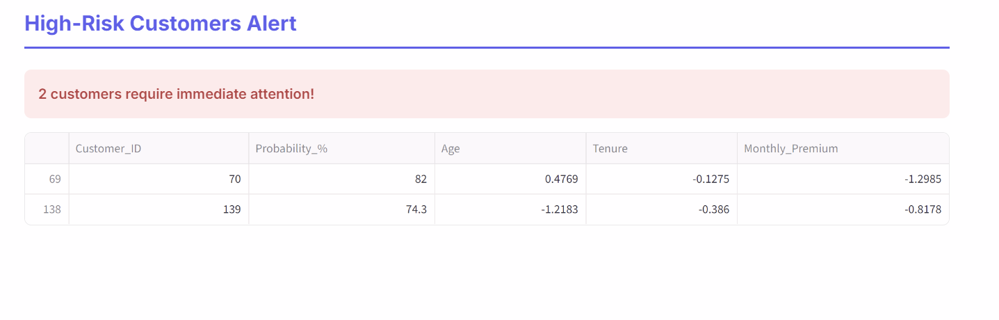

Insurance Customer Churn Prediction
🚀 **Live App:** [View Dashboard](https://insurance-customer-churn-5x6tuwr3irwxs7frwntk26.streamlit.app/)

I've built this machine learning project to help insurance companies figure out which customers might cancel their policies soon. By digging into customer habits and policy details, the model spots at-risk folks early, so teams can reach out with personalized offers or support to keep them onboard and boost retention.

Tech Stack:

Python 

Pandas & NumPy for data  processing

Scikit-learn for quick baseline machine learning models

LightGBM for super-fast, accurate predictions

Day 1 – Project Setup & Planning

Today, I started the project by setting everything up. I chose the insurance domain to predict customer churn and found a dataset for it. I also created a GitHub repository with a clean structure and added clear documentation to make future work easier.

What I did:
 -Chose the insurance domain for churn prediction
 -Found and reviewed a relevant dataset
 -Defined the project goal and purpose
 -Set up a GitHub repository with organized folders
 -Added clear notes in the README
 -Committed and pushed the initial setup to GitHub

Day 2 – Exploratory Data Analysis (EDA)

- Loaded the insurance churn dataset
- Understood the columns and data types
- Checked how many customers churned vs not churned
- Observed basic patterns and relationships in the data
- Got the data ready for model building

Day 3 – Model Development

On Day 3, I worked on building the churn prediction model using machine learning.
I focused on training the model and preparing it for future predictions.

What I did:
-Selected LightGBM algorithm for churn prediction
-split the dataset into training and testing sets
-Trained the model using the training data
-Saved the trained logic inside the src folder

Day 4 – Model Insights

On day 4, I worked on understanding how the churn prediction model behaves.

What I did:
 -Checked model performance
 -Looked at feature importance
 -Analyzed predictions and results
 -Added insights in model_insights.ipynb

Day 5 – Saving the AI Logic
Today, I focused on making sure the AI's "brain" was ready for the real world. After fine-tuning the model, I saved it as a file so that I could use it in my application without having to train it every single time. 

What I did:
- Finalized the best version of my LightGBM model.
- Saved the trained model into the `models/` folder.
- Cleaned up my code folders to keep things organized.

Day 6 – Building the Modern Dashboard
This was an exciting day! I built a website (using Streamlit) so that anyone could actually use my AI. I wanted it to be more than just numbers, so I added interactive charts and a special feature that tells you exactly what to do next to keep a customer.

What I did:
- Created a beautiful, interactive dashboard.
- Added a "Single Prediction" tool for one-on-one checks.
- Added a "Batch Analysis" tool to check thousands of customers at once.
- Added visual charts to show where the risks are.

Day 7 – Polishing and Final Testing
I spent the last day making everything look professional and fixing small bugs. I removed all the "toy" elements and went with a clean, solid design that looks like a real corporate tool. I also made sure all the files were synced and ready for deployment.

What I did:
- Cleaned up the UI for a professional "Solid Color" look.
- Added a "Recent Checks" history feature to the sidebar.
- Fixed small bugs to make sure everything runs perfectly.
- Finalized the documentation and requirements for the launch.

---

 Visual Project Overview

#### 1. Backend & AI Logic
Here is how the AI model looks when it's being trained. It shows the accuracy and how the "brain" thinks.

#### 2. The Main Dashboard
This is the simple and clean website where users can enter customer info.

#### 3. Real-Time Results
When you click predict, the AI gives a score and tells you exactly what to do next.

#### 4. Large Scale Analysis
This shows what happens when we check thousands of customers at once with charts and tables.

Conclusion

This project was a journey from raw data to a real-world business tool. By combining **LightGBM Machine Learning** with a clean **Streamlit Dashboard**, I've created a system that doesn't just predict the future—it helps insurance companies change it. 

Through this 7-day process, I’ve built a bridge between complex AI logic and actionable business decisions. This project is now fully ready to help retention teams save customers and grow their business.
