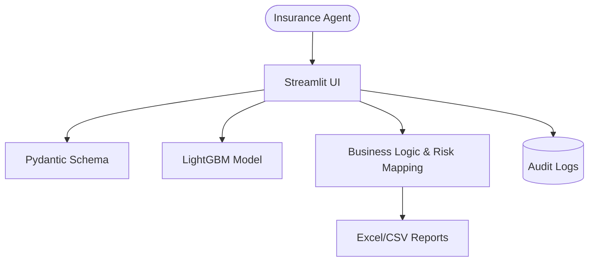

# 🛡️ Insurance Customer Churn Prediction System

Live Industrial-Grade AI Dashboard for Customer Retention.

## 📌 Project Overview

This repository features an end-to-end Machine Learning solution for predicting insurance customer churn. It transforms raw customer data into actionable business intelligence using a high-performance **LightGBM** model and a modern **Streamlit** dashboard.

The system is designed with **Industrial Standards** in mind, featuring:
- **Modularity**: Clean separation of UI, business logic, and configuration.
- **Robustness**: Pydantic-based input validation and comprehensive logging.
- **Explainability (XAI)**: SHAP-based local explanations to see exactly why an individual customer is at risk, alongside global feature importance.
- **Simulation**: A "What-If" tool for business stakeholders to test retention strategies.

## 🏗️ System Architecture

The project follows a modular tiered architecture:


```mermaid
graph TD
    User([Insurance Agent]) --> UI[Streamlit UI]
    UI --> Validation[Pydantic Schema]
    UI --> ML[LightGBM Model]
    UI --> Logic[Business Logic & Risk Mapping]
    Logic --> Reports[Excel/CSV Reports]
    UI --> Logs[(Audit Logs)]
```

- **`ui/app.py`**: The main entry point (Dashboard).
- **`src/utils.py`**: Core business logic, validation, and chart generation.
- **`src/config.py`**: Centralized domain mappings and UI styling.
- **`src/logger.py`**: Standardized logging for production auditing.
- **`models/`**: Serialized model binaries.

## 🚀 Getting Started

### Prerequisites
- Python 3.10+
- Virtual Environment (recommended)

### Installation

1. **Clone the repository:**
   ```bash
   git clone https://github.com/Sevani2005/insurance-customer-churn.git
   cd insurance-customer-churn
   ```

2. **Install dependencies:**
   ```bash
   pip install -r requirements.txt
   ```

3. **Run the application:**
   ```bash
   streamlit run ui/app.py
   ```

### Using Docker

The project is fully containerized for easy deployment:
```bash
docker build -t insurance-churn-app .
docker run -p 8501:8501 insurance-churn-app
```

## 📊 Key Features

### 1. Single Customer Prediction
Input custom features to get an immediate risk score, automated recommended next steps, and a breakdown of decision factors.

### 2. Batch Analysis
Upload or load existing customer datasets to identify at-risk segments across the entire portfolio. Supports export to **Excel** and **CSV**.

### 3. What-If Retention Simulator
Interactive sliders allow managers to simulate how changing policy terms (e.g., lowering premiums or applying discounts) impacts the churn probability in real-time.

## 🧪 Testing & Validation

Run unit tests to verify the risk classification logic:
```bash
python -m pytest tests/
```

## 🛠️ Tech Stack
- **Modeling**: LightGBM, Scikit-learn
- **Dashboard**: Streamlit, Plotly
- **Data**: Pandas, NumPy
- **Engineering**: Pydantic, Docker, Python-Logging, OpenPyXL
