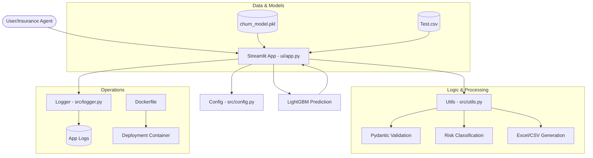

# System Architecture

The Insurance Churn Prediction System is designed with a modular architecture to ensure scalability, maintainability, and industrial reliability.

## Architecture Diagram

## Component Overview

1.  **UI Level (`ui/app.py`)**: Handles the user interface, sidebar history, and the three main feature tabs (Single Prediction, Batch Analysis, What-If Simulation).
2.  **Configuration Level (`src/config.py`)**: Centralizes categorical mappings, CSS styles, and risk thresholds.
3.  **Utility Level (`src/utils.py`)**: Contains reusable logic like Pydantic data validation, risk calculation, and report generation.
4.  **Logging Level (`src/logger.py`)**: Provides standardized logging for auditing model predictions and error tracking.
5.  **Model Level**: Uses a pre-trained LightGBM model for high-speed, high-accuracy inference.
